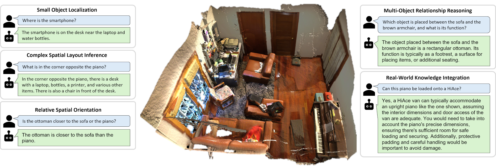

# SpatialPrompting: Keyframe-driven **Zero-Shot Spatial Reasoning**
<p align="center">
  <a href="https://arxiv.org/abs/2505.04911"></a>
  <a href="https://github.com/ToyotaCRDL/SpatialPrompting/blob/main/LICENSE"></a>
  <a href="https://pytorch.org/">=2.5-EE4C2C.svg" alt="PyTorch"></a>
  <a href="https://python.org/"></a>
</p>

**Official PyTorch implementation of  
[“SpatialPrompting: Keyframe-driven Zero-Shot Spatial Reasoning with Off-the-Shelf Multimodal Large Language Models.”](http://arxiv.org/abs/2505.04911)**  
Shun **Taguchi**, Hideki **Deguchi**, Takumi **Hamazaki**, Hiroyuki **Sakai**

<div align="center">
  
</div>

## Table of Contents
1. [Overview](#overview)
2. [Installation](#installation)
3. [Data Preparation](#data-preparation)
4. [Quick Start](#quick-start)
5. [Citation](#citation)
6. [License](#license)

## Overview
SpatialPrompting tackles **zero-shot spatial question answering in 3D scenes** by
1. extracting representative **keyframes** based on spatial and semantic features, and
2. constructing **LLM prompts** that embed spatial context without any 3D-specific fine-tuning.  

This repository contains:
- **Feature Extraction** – `extract_features.py`  
- **Interactive Spatial QA** – `spatialqa.py`  
- **Benchmark Inference** – `predict_scanqa.py`, `predict_sqa3d.py`  
- **Evaluation** – `score_scanqa.py`, `score_sqa3d.py`

---

## Installation

### 1. Clone repo
```bash
git clone https://github.com/ToyotaCRDL/SpatialPrompting.git
cd SpatialPrompting
```

### 2. Create environment (conda example)
```bash
conda create -n spatialprompting python=3.10 -y
conda activate spatialprompting
```
### 3. Install PyTorch and other dependencies
Install PyTorch (see <https://pytorch.org>), and other dependencies:
```bash
# CUDA 11.8 build
pip install torch==2.5.0+cu118 torchvision torchaudio --index-url https://download.pytorch.org/whl/cu118
```
```bash
pip install -r requirements.txt
```
The project is tested on Ubuntu 22.04 + Python 3.10 + CUDA 11.8 + PyTorch 2.5.0.

### 4. Set API keys:
```bash
export OPENAI_API_KEY="your_openai_key"
export GOOGLE_API_KEY="your_gemini_key"
```

---

## Data Preparation
```
/path/to/your/data
└── data
    ├── ScanNet
    ├── ScanQA
    └── SQA3D
```

- Please extract .sens files of the ScanNet.
- When running the scripts, specify the base path using the `--base_path` argument. 

## Quick Start

### 1. Extract Spatial Features
```bash
python extract_features.py \
  --base_path /path/to/your/data \
  --dataset scannet \
  --env scene0050_00 \
  --model vitl336
```

### 2. Interactive Spatial QA
```bash
python spatialqa.py \
  --llm gpt-4o-2024-11-20 \
  --feature /path/to/spatial_feature.npz \
  --image_num 30
```
### 3. Predict & Evaluate ScanQA & SQA3D Dataset
- ScanQA
  - Predict:
  ```bash
  python predict_scanqa.py \
    --base_path /path/to/your/data \
    --llm gpt-4o-2024-11-20 \
    --model vitl336 \
    --image_num 30
  ```
  - Evaluate:
  ```bash
  python score_scanqa.py \
    --base_path /path/to/your/data \
    --pred /path/to/prediction.jsonl \
    --use_spice # optional
  ```

- SQA3D
  - Predict:
  ```bash
  python predict_sqa3d.py \
    --base_path /path/to/your/data \
    --llm gpt-4o-2024-11-20 \
    --model vitl336 \
    --image_num 30
  ```
  - Evaluate:
  ```bash
  python score_sqa3d.py \
    --base_path /path/to/your/data \
    --pred /path/to/prediction.jsonl
  ```
  
## Citation

If you find this project useful in your research, please consider citing:

```
@article{taguchi2025spatialprompting,
  title={SpatialPrompting: Keyframe-driven Zero-Shot Spatial Reasoning with Off-the-Shelf Multimodal Large Language Models},
  author={Taguchi, Shun and Deguchi, Hideki and Hamazaki, Takumi and Sakai, Hiroyuki},
  journal={arXiv preprint arXiv:2505.04911},
  year={2025}
}
```
## License

T.B.D
